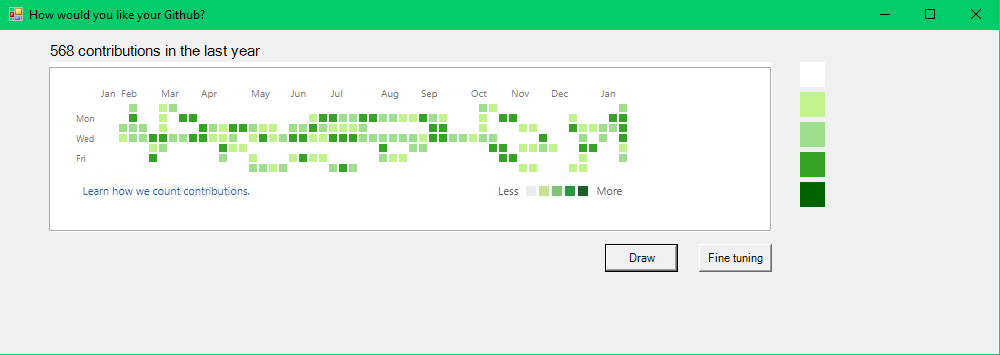

# GithubContributionIllusion

A windows form app to draw fake Github Contributions, so you can screen shot and show off. Ideas comes from commiting hard every day
but takeing too long to get accomplishments. During the development, learned how to handle events properly.

## Requirements

Windows Operating System

## Common steps

* Clone this repo

* Find the GithubContributionIllusion.exe file in GithubContributionIllusion\GithubContributionIllusion\bin\Debug and double click

## Interfaces

## Use Intro

* Click draw to enable draw mode.

* Click anywhere inside the tiles area to start. Tiles will be colored randomly as you move the mouse.

* Click again inside the tiles area to stop drawing.

* Click the Fine tuning button to enable Fine-tuning mode.

* Pick the color you want to use in the rightside bar.

* Click on the tile you wang to adjust.

## Issues

* The month bar does not change dynamically.

